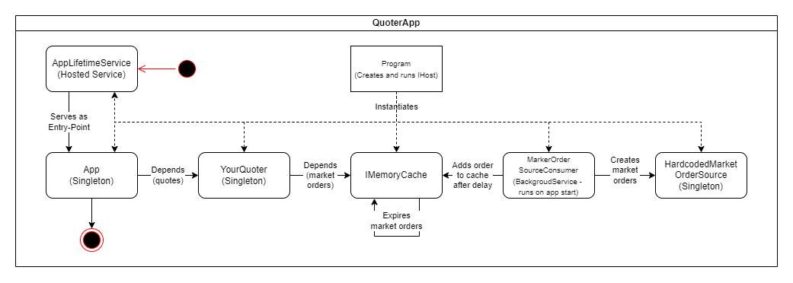
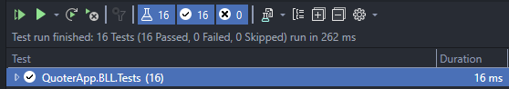

# Market Quoter Component

Your task is to implement market quoter component defined in the *IQuoter* interface.

You have two methods to implement in *YourQuoter.cs*:
1. GetQuote
  - Takes instrument and quantity to quote, returns best possible price with current quotes
2. GetVolumeWeightedAveragePrice
  - Takes instrument ID and calculates volume-weighted average price for the instrument

## MarketOrderSource

As I was allowed to change *MarkedOrderSource* so I took the liberty and rewrote it as a random market order generator for 3 predefined instruments while not changing its interface.  

Created a consumer for *IMarketOrderSource* which was a background service called *MarkerOrderSourceConsumer* that with a random delay (to simulate asynchronous behaviour of the market) put randomly generated market order into *IMemoryCache*.  

Market orders in *IMemoryCache* have a random expiration time to simulate orders expiring or being filled by external entities in the market.

## Quoter

Injected *IMemoryCache* as a dependency into *YourQuoter* to be used as a cache for currently available market orders to simulate existing known volume in the market.  

Needed a way to access all stored data in *IMemoryCache* without using *CacheEntry* key, cache API didn't provide such a method so I used Reflection to access underlying private *EntriesCollection* and queried market orders with required *InstrumentID* using LINQ.  

Could probably find an alternative for *IMemoryCache* with an API that suited my needs but using reflection is also a valid approach :D  

Having access to requited market orders was able to implement *GetQuote* (with partial filling option) and *GetVolumeWeightedAveragePrice*.

## Testing 

Used *NUnitTest* to write unit tests for *YourQuoter* class.  
Into *YourQuoter* injected a new instance of *IMemoryCache* with predictable mocked values.  

## Implementation Notes
- Given the changed implementation of *HardcodedQuoteSource* together with *MarketOrderSourceConsumer* was able to simulate a situation where there is not enough order volume available to fill the Quote. 
- Given the changed implementation of *HardcodedQuoteSource* together with *MarketOrderSourceConsumer* was able to simulate creating and deleting orders as they are created and filled throughout the day in an open market.

Using *HardcodedQuoteSource* together with *MarketOrderSourceConsumer* tried to approximate the real-world implementation of such system. Real-world implementation could work like this:
1. *HardcodedQuoteSource* may be replaced with a broker message stream that would send messages containing new/filled market orders using a message broker.
1. *MarketOrderSourceConsumer* may consume message broker messages and write market order changes (creation/filling) to the cache (ex. Redis)
1. The *IMemoryCache* dependency in *YourQuoter* could be replaced with a dependency that allows for access to an external cache.
